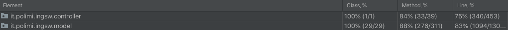

# Prova finale del corso "Ingegneria del Software" A.A. 2020-2021

## Members
* [Mattia Sironi](https://github.com/MattiaSironi)
* [Simone Tagliente](https://github.com/smntgl)
* [Lea Zancani](https://github.com/LeaZancani)

# Master of Renaissance


# Extra Features


| Functionality | Done |
|:-----------------------|:------------------------------------:|
| Basic rules | yes  |
| Complete rules | yes |
| Socket | yes |
| GUI | yes |
| CLI | yes |
| Multiple games | yes |
| Persistence | no |
| Parameters editor | no |
| Local game | yes |
| Connection resilience | no | 

# How to run

* Step 1: Clone the repository ([link](https://github.com/GIGIProgrammer/ing-sw-2021-sironi-tagliente-zancani))
* Step 2: Open the folder ing-sw-2020-sironi-tagliente-zancani/Deliverables/JAR in terminal and type
    ```shell
    > java -jar GC21-1.0-SNAPSHOT-jar-with-dependencies.jar
    ```
  - to run the server directly use:
    
    ```shell
    > java -jar GC21-1.0-SNAPSHOT-jar-with-dependencies.jar server
    ```
    Note: server port is standard and set to 1234. Use port forwarding to play in a distributed system.
    
  - to run the CLI directly use:

    ```shell
    > java -jar GC21-1.0-SNAPSHOT-jar-with-dependencies.jar CLI
    ```
    Note: do not use Windows Command Prompt or PowerShell. For better experience, use a Unix-like terminal.
  - to run the GUI directly use:
    ```shell
    > java -jar GC21-1.0-SNAPSHOT-jar-with-dependencies.jar GUI
    ```
    
## Tools

* [MagicDraw](https://www.magicdraw.com/main.php?ts=navig&cmd_go_to_login_custom_pages=1&menu=download_no_cost_plugins&back_cmd=cmd_show) - UML Diagram
* [IntelliJ](https://www.jetbrains.com/idea/) - IDE
* [Maven](https://maven.apache.org/) - Dependency Management
* [JavaFX](https://openjfx.io) - Graphical Framework
* [JUnit](https://junit.org/junit5/) - Testing

## Test Coverage



